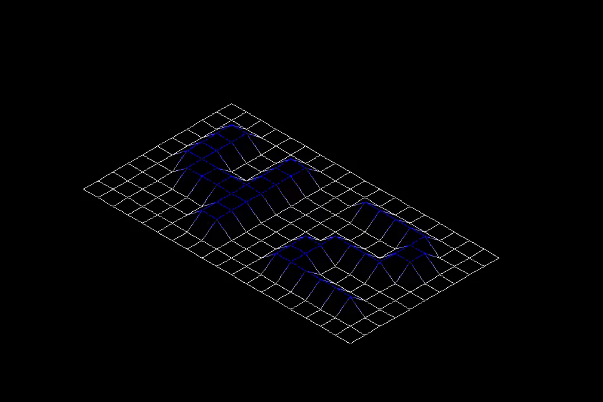
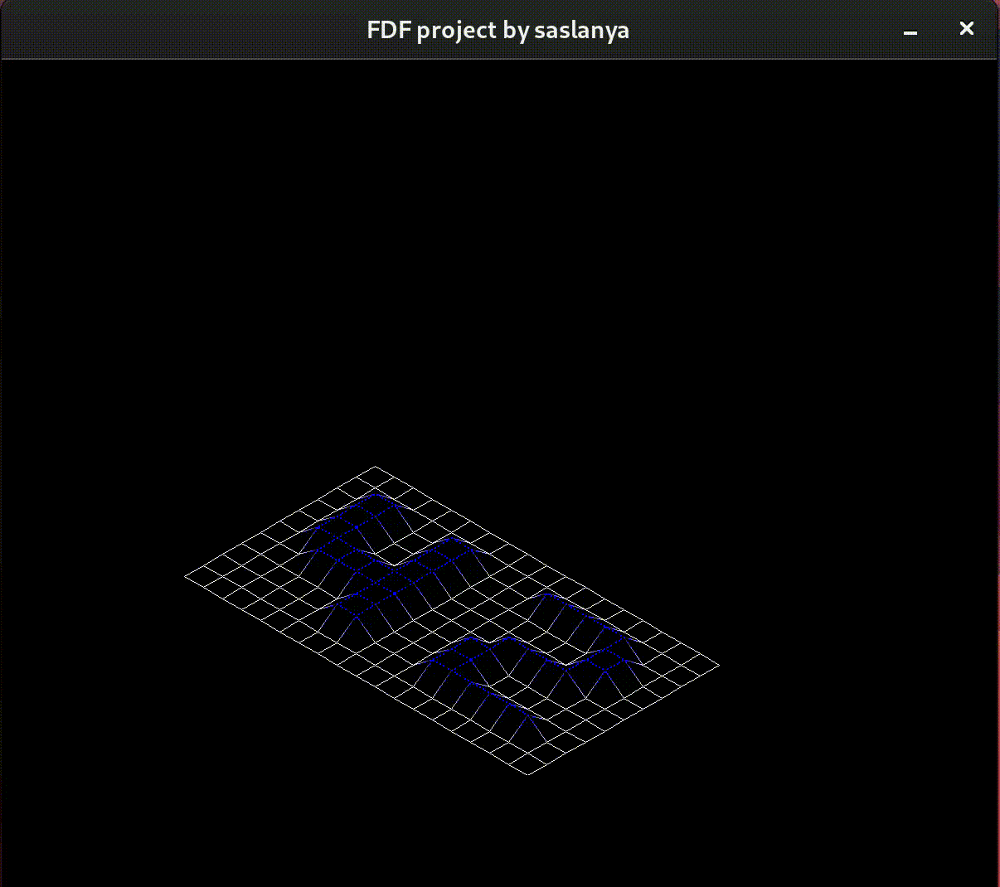
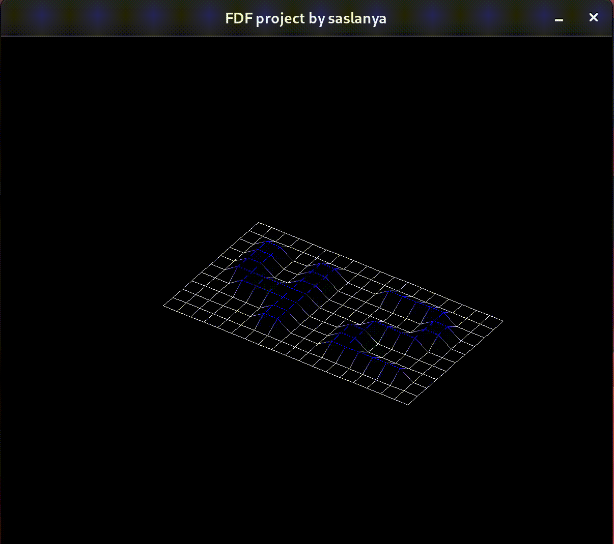
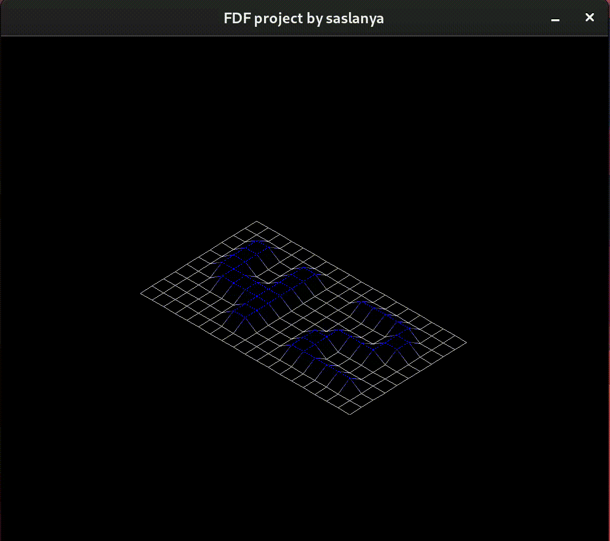

FDF is a project of school 42 aimed at understanding the graphical interface and writing a program that works with windows and with the image.



#### Highlights 
The project is divided into several parts for better understanding and design .

● Library that we can use,

● Validation_checkers,

● Matrix structure implementation,
● Graphic functions and t_data structure implementation (need to be for with library mlx( X11, opengl framework),

● fdf part of window and image management.

While working with the window, the user has the ability to manipulate the displayed object using these keys.

● ' ←, →, ↑, ↓ '  --   to move the object itself.


● 'c'             --   changes color.

● 'i'             --   transform to isometric projection (by default).

● 'p'             --   transform to perspective projection.

● 'x'             --   rotate_x.




● 'y'             --   rotate_y.




● 'z'             --   rotate_z.




● '+'             --   zoom-in.

● '-'             --   zoom-out.


## How to Use on Linux

### Prerequisites

1. Install the required dependencies:
   ```bash
   sudo apt-get update -y
   sudo apt-get install build-essential -y
   sudo apt-get install xorg libxext-dev zlib1g-dev libbsd-dev -y
   ```
2. Clone the repository:
   ```bash
   git clone https://github.com/jesuismarie/FdF.git
   ```
3. Compile the program:
   ```bash
   make
   ```
4. Run FDF with a map from **test_maps**:
   ```bash
   ./fdf maps/[map-name.fdf]
   ```

---

## How to Use on MacOS

1. Clone the repository:
   ```bash
   git clone https://github.com/jesuismarie/FdF.git
   ```
2. Compile the program:
   ```bash
   make
   ```
3. Run FDF with a map from **test_maps**:
   ```bash
   ./fdf maps/[map-name.fdf]
   ```

---
